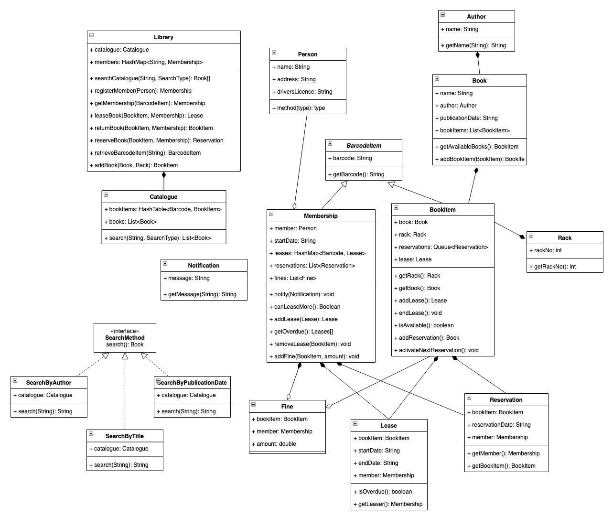

## Library Management System

Building a Library Management System in Java for Object-Oriented Design practice.

## Possible Improvements
- [ ] Library could have other types of borrowable items. Should implement a `Borrowable` interface for all borrowable items. Then use this interface when leasing, returning and reserving.
- [ ] Library could implement more complex conditions for leasing, reserving, borrowing. Possibly use _State Pattern_ to manage valid and invalid state transitions for the status of a book item.
- [ ] Library could choose to notify users via different mediums e.g. Email, SMS. System should be able to notify all channels.